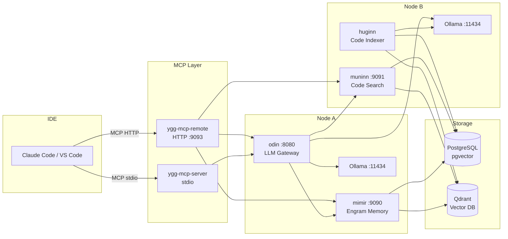

# Yggdrasil

> **Status: Alpha** -- Core services (Odin, Mimir, Huginn, Muninn, MCP) are deployed and running in production on a homelab. APIs may change between releases. Some crates (`ygg-agent`, `ygg-node`) are work-in-progress.

A distributed AI memory, code indexing, and retrieval system built in Rust. Yggdrasil runs on a local network of machines to provide associative memory (engrams), semantic code search, LLM orchestration, and IDE integration via the [Model Context Protocol (MCP)](https://modelcontextprotocol.io/).

Designed for local-first AI development -- your data stays on your hardware, and your wallet stays intact. By routing code generation, embeddings, and RAG queries through local LLMs (Ollama), Yggdrasil cuts your cloud API token costs dramatically while keeping response times fast on your own network.

## What It Does

- **Engram Memory** (Mimir) -- Store and recall cause-effect knowledge pairs using sparse distributed representations (SDR) and vector search
- **Code Indexing** (Huginn) -- Watch directories, parse code with tree-sitter (Rust, Python, TypeScript, JS, Go, Markdown), embed chunks, and write to PostgreSQL + Qdrant
- **Semantic Code Search** (Muninn) -- Hybrid BM25 + vector search with reciprocal rank fusion
- **LLM Orchestration** (Odin) -- OpenAI-compatible API gateway with semantic routing, RAG pipeline, session continuity, and cloud provider fallback
- **MCP Integration** -- 14 tools and 3 resources exposed to IDEs (Claude Code, VS Code) for code search, memory queries, LLM generation, and Home Assistant control
- **Home Assistant** -- Query states, control devices, and generate automation YAML through MCP tools

## Architecture



See [docs/ARCHITECTURE.md](docs/ARCHITECTURE.md) for the full system topology with detailed Mermaid data flow diagrams.

## Crate Overview

| Crate | Type | Status | Description |
|-------|------|--------|-------------|
| `odin` | Binary | Stable | LLM orchestrator and API gateway (port 8080) |
| `mimir` | Binary | Stable | Engram memory service with SDR + vector search (port 9090) |
| `huginn` | Binary | Stable | File watcher and code indexer using tree-sitter (port 9092) |
| `muninn` | Binary | Stable | Semantic code retrieval engine (port 9091) |
| `ygg-mcp-server` | Binary | Stable | Local MCP server (stdio transport) |
| `ygg-mcp-remote` | Binary | Stable | Remote MCP server (StreamableHTTP, port 9093) |
| `ygg-sentinel` | Binary | Beta | System monitoring and health checks |
| `ygg-voice` | Binary | Beta | Whisper STT + Kokoro TTS pipeline |
| `ygg-agent` | Binary | WIP | Autonomous task delegation |
| `ygg-installer` | Binary | Beta | Deployment automation CLI |
| `ygg-node` | Binary | WIP | Distributed node controller |
| `ygg-domain` | Library | Stable | Shared types, config structs, domain errors |
| `ygg-config` | Library | Stable | Config loading with env var expansion and file watching |
| `ygg-store` | Library | Stable | PostgreSQL + Qdrant database abstraction |
| `ygg-embed` | Library | Stable | ONNX embedding inference (all-MiniLM-L6-v2) |
| `ygg-mcp` | Library | Stable | MCP tool/resource definitions and handlers |
| `ygg-ha` | Library | Stable | Home Assistant REST API client |
| `ygg-mesh` | Library | Beta | mDNS service discovery and mesh networking |
| `ygg-cloud` | Library | Beta | Cloud provider fallback routing (OpenAI, Claude, Gemini) |
| `ygg-energy` | Library | Beta | Power management and thermal control |

## Prerequisites

- **Rust** nightly or stable with edition 2024 support
- **PostgreSQL 16** with [pgvector](https://github.com/pgvector/pgvector) extension
- **Qdrant** vector database
- **Ollama** with a code-capable model (e.g., `qwen3-coder:30b-a3b-q4_K_M`)
- **ONNX Runtime** shared library (`libonnxruntime.so`) for local embedding inference

## Quick Start

```bash
# Clone
git clone https://github.com/jesushernandez/yggdrasil.git
cd yggdrasil

# Copy example configs and fill in your values
for dir in configs/*/; do
  example="${dir}config.example.json"
  target="${dir}config.json"
  [ -f "$example" ] && [ ! -f "$target" ] && cp "$example" "$target"
done

# Set required environment variables (see .env.example)
cp .env.example .env
# Edit .env with your database URLs, HA token, etc.

# Build all services
cargo build --release

# Run a service (example: Odin)
./target/release/odin --config configs/odin/config.json
```

> **Important: Distributed deployment.** Yggdrasil is designed to run across
> multiple machines on a private LAN. Most config values (database URLs, Qdrant
> addresses, Ollama endpoints) need to point to the actual IPs of the machines
> hosting those services -- not `localhost`. For example, if PostgreSQL runs on
> Node A and Huginn runs on Node B, Huginn's `database_url` must use Node A's
> LAN IP. Review each `config.example.json` and replace the `<node-ip>`
> placeholders with your real network addresses. See
> [docs/NetworkHardware.md](docs/NetworkHardware.md) for an example topology.

## Configuration

Each service reads a JSON config file from `configs/<service>/config.json`. Template files (`config.example.json`) are provided -- copy them and fill in your deployment values.

Environment variables are expanded in config files using `${VAR_NAME}` syntax. See [.env.example](.env.example) for all required variables.

## Deployment

Yggdrasil is designed to run across multiple machines on a private LAN. See:

- [docs/USAGE.md](docs/USAGE.md) -- All API endpoints, startup commands, deploy procedures
- [docs/OPERATIONS.md](docs/OPERATIONS.md) -- Monitoring, debugging, backup procedures
- [deploy/](deploy/) -- Install scripts, systemd unit templates, Docker Compose files

## Documentation

| Document | Description |
|----------|-------------|
| [ARCHITECTURE.md](docs/ARCHITECTURE.md) | System topology, Mermaid data flows, service registry |
| [USAGE.md](docs/USAGE.md) | API endpoints, startup and deploy commands |
| [OPERATIONS.md](docs/OPERATIONS.md) | Monitoring, debugging, backup |
| [NetworkHardware.md](docs/NetworkHardware.md) | Hardware reference template |
| [HARDWARE_OPTIMIZATION.md](docs/HARDWARE_OPTIMIZATION.md) | Performance tuning guide |
| [NAMING_CONVENTIONS.md](docs/NAMING_CONVENTIONS.md) | Crate and module naming rules |

## License

This project is licensed under the [Business Source License 1.1](LICENSE).

- **Free** for personal, educational, research, and non-commercial use (under $5k/year revenue)
- **Commercial use** by any organization requires a separate license -- contact the author
- Converts to **Apache 2.0** on the change date (2030-03-12)

## Support the Project

Yggdrasil is built nights and weekends by a solo developer who would love nothing more than to work on this full-time. If you find it useful, consider supporting development:

- [GitHub Sponsors] COMING SOON
- [Buy Me a Coffee](https://buymeacoffee.com/jourgoundd)
- [Ko-fi]COMING SOON

Every contribution -- no matter how small -- gets me one step closer to making this my day job. Thank you.

## Contributing

See [CONTRIBUTING.md](CONTRIBUTING.md) for guidelines.

## Built With

This project was developed with the assistance of AI coding tools:

- **Claude Opus 4.6** and **Claude Sonnet 4.6** (Anthropic) -- Architecture, implementation, and code review
- **Gemini 3.1** (Google) -- Research and implementation assistance
- **Qwen Coder 30B-A3B** (Alibaba, x2 local instances via Ollama) -- On-device code generation, RAG context, and the backbone LLM that Yggdrasil itself orchestrates
