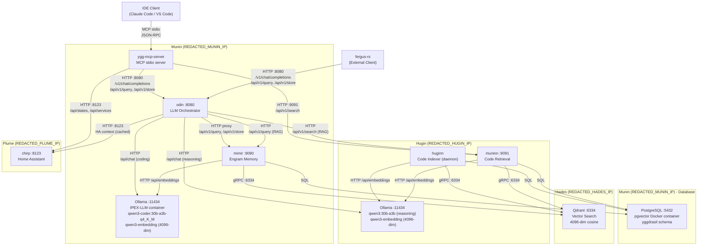
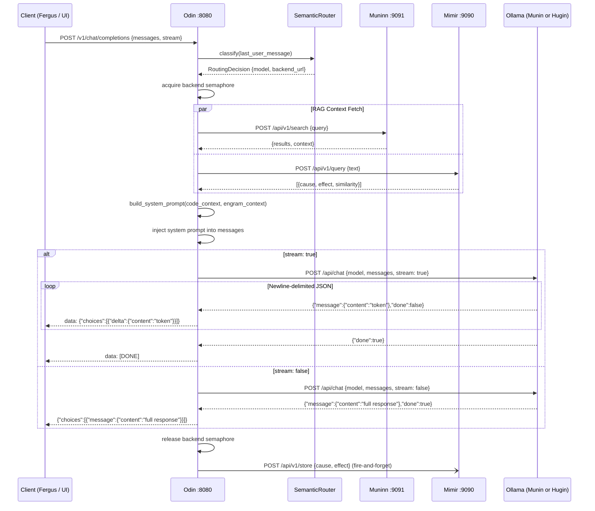
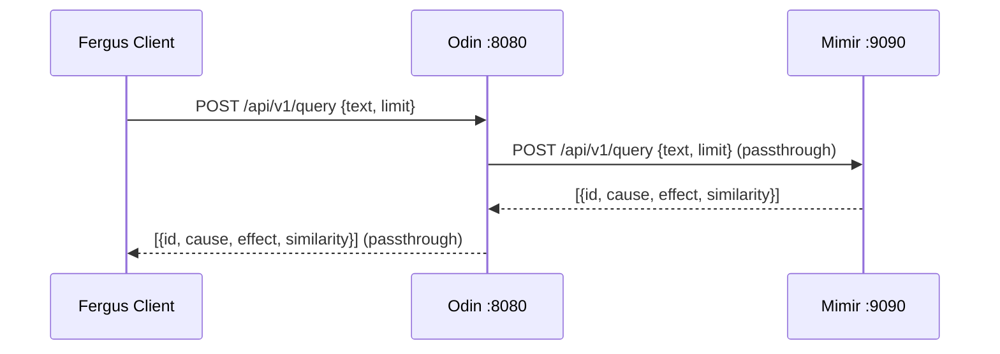
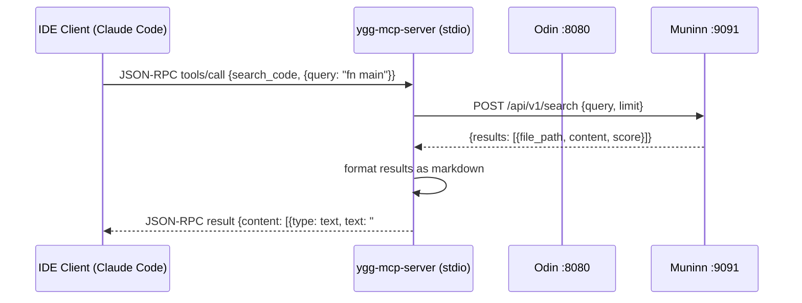
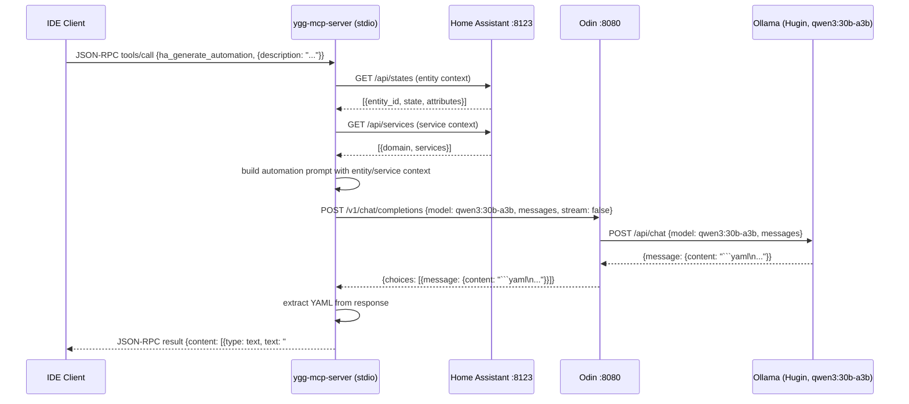

# Yggdrasil Architecture

## Overview

Yggdrasil is a distributed AI memory and retrieval system composed of specialized Rust services that communicate over HTTP/gRPC on a private LAN. It provides associative memory (engrams), code indexing, semantic retrieval, MCP tool integration for IDEs, and Home Assistant smart-home control for the Fergus AI assistant.

## System Topology



## Service Registry

| Service | Crate | Binary | Port | Responsibility | Owned Data | Status |
|---------|-------|--------|------|----------------|------------|--------|
| **Odin** | `crates/odin` | `odin` | 8080 | OpenAI-compatible API gateway, semantic routing, RAG pipeline, SSE streaming, Mimir proxy, HA context injection, Prometheus metrics | Routing rules (in-memory from config), HA context cache (60s TTL) | DONE (Sprint 005) |
| **Mimir** | `crates/mimir` | `mimir` | 9090 | Engram memory CRUD, embedding, dedup, LSH indexing | `yggdrasil.engrams`, `yggdrasil.lsh_buckets`, Qdrant `engrams` collection | DONE (Sprint 002) |
| **Huginn** | `crates/huginn` | `huginn` | 9092 (health) | File watcher, tree-sitter AST chunking, code indexing | `yggdrasil.indexed_files`, `yggdrasil.code_chunks`, Qdrant `code_chunks` collection | DONE (Sprint 003) |
| **Muninn** | `crates/muninn` | `muninn` | 9091 | Semantic code retrieval (vector + BM25 fusion) | Read-only from Huginn's tables | DONE (Sprint 004) |
| **ygg-mcp-server** | `crates/ygg-mcp-server` | `ygg-mcp-server` | N/A (stdio) | MCP server exposing 9 tools (code search, memory, generation, 4 HA tools) and 2 resources to IDE clients via JSON-RPC over stdin/stdout | None (stateless bridge) | DONE (Sprint 006) |

## Shared Libraries

| Crate | Responsibility | Dependents |
|-------|---------------|------------|
| `ygg-domain` | All type definitions: `Engram`, `CodeChunk`, `MemoryTier`, config structs, domain errors. Leaf crate with zero I/O. | All services |
| `ygg-store` | PostgreSQL connection pool (`Store`), engram CRUD, chunk CRUD, Qdrant client (`VectorStore`). All database I/O. | mimir, huginn, muninn |
| `ygg-embed` | Ollama embedding HTTP client (`EmbedClient`). Single and batch embedding. | mimir, huginn, muninn |
| `ygg-mcp` | MCP tool/resource definitions, server handler, tool implementations (code search, memory, generation, HA). Library crate. | ygg-mcp-server |
| `ygg-ha` | Home Assistant REST API client (`HaClient`), automation YAML generation (`AutomationGenerator`). | ygg-mcp, odin |

## Data Flow: Engram Store

```mermaid
sequenceDiagram
    participant C as Fergus Client
    participant M as Mimir
    participant O as Ollama
    participant PG as PostgreSQL
    participant QD as Qdrant

    C->>M: POST /api/v1/store {cause, effect}
    M->>M: SHA-256(cause + effect) for dedup
    M->>O: POST /api/embeddings {model, prompt: cause}
    O-->>M: {embedding: [f32; 4096]}
    M->>PG: INSERT INTO engrams (embedding, hash, ...)
    PG-->>M: OK / 23505 (duplicate)
    M->>QD: Upsert point (id, embedding)
    QD-->>M: OK
    M->>M: LSH index insert
    M-->>C: 201 {id: "uuid"}
```

## Data Flow: Engram Query

```mermaid
sequenceDiagram
    participant C as Fergus Client
    participant M as Mimir
    participant O as Ollama
    participant QD as Qdrant
    participant PG as PostgreSQL

    C->>M: POST /api/v1/query {text, limit}
    M->>O: POST /api/embeddings {model, prompt: text}
    O-->>M: {embedding: [f32; 4096]}
    M->>QD: Search(embedding, limit)
    QD-->>M: [(uuid, score), ...]
    M->>PG: SELECT * FROM engrams WHERE id = ANY($1)
    PG-->>M: [Engram, ...]
    M->>PG: UPDATE access_count, last_accessed
    M-->>C: 200 [{id, cause, effect, similarity}, ...]
```

## Data Flow: Chat Completion (Odin Orchestrator)



## Data Flow: Mimir Proxy (Fergus Compatibility)



## Data Flow: MCP Tool Call (Sprint 006)



## Data Flow: HA Automation Generation (Sprint 006)



## External Services

| Service | Host | Port | Protocol | Used By |
|---------|------|------|----------|---------|
| Home Assistant | chirp (REDACTED_CHIRP_IP) | 8123 | HTTP REST + Bearer token | ygg-ha (via ygg-mcp-server and odin) |
| Ollama (Munin) | localhost (IPEX-LLM container) | 11434 | HTTP | odin, mimir |
| Ollama (Hugin) | REDACTED_HUGIN_IP | 11434 | HTTP | odin, huginn, muninn |
| PostgreSQL | Munin (localhost, pgvector Docker) | 5432 | SQL | mimir, huginn, muninn (via ygg-store) |
| Qdrant | hades (REDACTED_HADES_IP) | 6334 | gRPC | mimir, huginn, muninn (via ygg-store) |

## Database Schema

All tables live in the `yggdrasil` schema on PostgreSQL (pgvector Docker container on Munin, localhost:5432).

### Engram Tables (Migration 001)
- `yggdrasil.engrams` -- cause-effect memory pairs with pgvector embeddings
- `yggdrasil.lsh_buckets` -- LSH index persistence (table_idx, bucket_hash, engram_id)

### Code Index Tables (Migration 002)
- `yggdrasil.indexed_files` -- tracked source files with content hashes
- `yggdrasil.code_chunks` -- AST-extracted semantic units with tsvector for BM25

### Qdrant Collections (on Hades REDACTED_HADES_IP:6334)
- `engrams` -- 4096-dim cosine, point IDs match `engrams.id`
- `code_chunks` -- 4096-dim cosine, point IDs match `code_chunks.id`

## Configuration

Each service loads its config from `configs/<service>/config.yaml`. Config structs are defined in `ygg_domain::config`. CLI flags can override specific values (e.g., `--database-url`).

---

## Changelog

| Date | Change | Author |
|------|--------|--------|
| 2026-03-09 | Initial architecture document. Service registry, data flows, schema overview. | system-architect |
| 2026-03-09 | Updated topology: Huginn and Muninn on Hugin (REDACTED_HUGIN_IP), Odin and Mimir on Munin (REDACTED_MUNIN_IP). Added Odin chat completion and Mimir proxy data flows. Updated service registry with Sprint 005 Odin details. | system-architect |
| 2026-03-09 | Added ygg-mcp-server to topology and service registry (Sprint 006). Added MCP tool call data flow. Added chirp (Home Assistant) to topology. Added HA automation generation data flow (Sprint 007). Added External Services table. Updated ygg-mcp and ygg-ha library descriptions. | system-architect |
| 2026-03-09 | Sprint 008 planned: Mimir Advanced Memory Management -- hierarchical summarization, Core tier injection, sliding-window eviction. Sprint 009 planned: Hardware Optimization -- iGPU SYCL, AVX-512, Exo eval, candle embedder. Sprint 010 planned: Production Hardening -- systemd units, Prometheus metrics, backup, deployment scripts, graceful degradation. Huginn gains health listener on port 9092. | system-architect |
| 2026-03-09 | Sprint 005 finalized as DONE. Corrected stale references: Hugin model updated from QwQ-32B to qwen3:30b-a3b (Sprint 013). Embedding dimension corrected from 1024 to 4096 (qwen3-embedding actual output). PostgreSQL location corrected from Hades to Munin pgvector Docker container. Munin Ollama annotated as IPEX-LLM container (Sprint 014). Huginn port 9092 added to service registry. All service statuses updated to DONE. | system-architect |
| 2026-03-09 | Sprint 006 finalized as DONE. ygg-mcp-server status updated to DONE in service registry. HA tools merged into Sprint 006 (originally planned for Sprint 007). HA automation data flow re-attributed from Sprint 007 to Sprint 006. 9 tools + 2 resources fully implemented. Known discrepancy: AutomationGenerator requests model qwq-32b but actual Hugin model is qwen3:30b-a3b. | system-architect |
| 2026-03-09 | Sprint 010 (Production Hardening) finalized as DONE. Bug fixes applied: (1) all qwq-32b/QwQ-32B model references in ygg-ha and ygg-mcp-server replaced with qwen3:30b-a3b -- resolves the discrepancy noted in the Sprint 006 changelog entry; (2) HA_TOKEN env var expansion added to ygg-mcp-server startup; (3) backup-hades.sh PG host corrected from Hades (REDACTED_HADES_IP/postgres) to Munin (127.0.0.1/yggdrasil); (4) WatchdogSec=30 re-enabled in all 4 daemon systemd units (odin, mimir, huginn, muninn). Two deploy-only items remain for infra-devops: backup cron job installation on Munin, and NetworkHardware.md model reference update. 57 tests pass, zero qwq references remaining. | system-architect |
