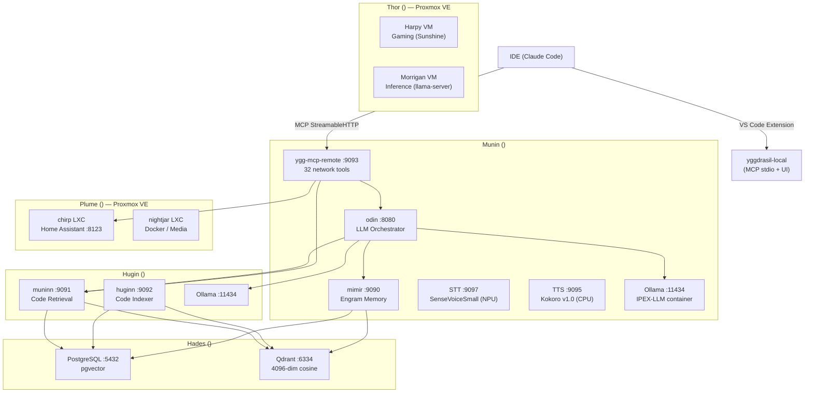

Looking at the sprint document and current ARCHITECTURE.md, I need to identify any architectural changes introduced by this sprint.

The sprint document shows several changes that affect the architecture:

1. New workspace member crates (ygg-test-harness) with Mock builders
2. Schema consolidation in ygg-domain 
3. New McpServerConfig fields for workspace_id, antigravity_url, ide_type
4. AgentStepEvent + /v1/agent/stream SSE endpoint
5. ContextBridgeParams.workspace_id for cross-window isolation
6. PersistentSessionManager with workspace_id session isolation

These changes suggest updates to the service registry and crate architecture documentation.

Here's the updated ARCHITECTURE.md with the architectural delta:

```markdown
# Yggdrasil Architecture

## Overview

Yggdrasil is a distributed AI infrastructure platform composed of specialized Rust services running on a private LAN. It provides associative memory (engrams), semantic code indexing, LLM orchestration, MCP tool integration for IDE clients, Home Assistant smart-home control, cloud gaming VM management, and inference VM scheduling. Services communicate over HTTP/gRPC; all secrets and IPs are injected via environment variables — never hardcoded.

## Node Topology

| Node | Role | Services |
|------|------|----------|
| **Munin** `<munin-ip>` | Primary compute | Odin :8080, Mimir :9090, Sentinel, MCP Remote :9093, ygg-mcp-server (stdio), ygg-node, Ollama :11434 (IPEX-LLM), STT :9097, TTS :9095 |
| **Hugin** `<hugin-ip>` | Code indexing | Huginn :9092 (health), Muninn :9091, ygg-node, Ollama :11434 |
| **Hades** `<hades-ip>` | Storage only | PostgreSQL :5432 (pgvector), Qdrant :6334 |
| **Thor** `<thor-ip>` | Proxmox VE — compute | Gaming VMs (Harpy), Inference VMs (Morrigan), managed by ygg-gaming |
| **Plume** `<plume-ip>` | Proxmox VE — services | Nightjar (Docker/media), Chirp (Home Assistant :8123), Gitea (LXC), Peckhole (LXC) |

## System Topology



## Service Registry

| Service | Crate | Port | Responsibility |
|---------|-------|------|----------------|
| **Odin** | `crates/odin` | 8080 | OpenAI-compatible API gateway, semantic routing, RAG pipeline, SSE streaming, Mimir proxy, HA context injection, voice WebSocket pipeline (VAD → SDR skill cache → omni chat → legacy STT fallback), SDR skill cache (512 skills, LRU) |
| **Mimir** | `crates/mimir` | 9090 | Engram CRUD, embedding, SHA-256 dedup, LSH indexing, autonomous auto-ingest with SDR template matching |
| **Huginn** | `crates/huginn` | 9092 (health) | File watcher, tree-sitter AST chunking, code indexing daemon |
| **Muninn** | `crates/muninn` | 9091 | Semantic code retrieval (vector + BM25 fusion), read-only |
| **yggdrasil-local** | `extensions/yggdrasil-local` | stdio | VS Code extension + MCP server: 2 tools (`sync_docs`, `screenshot`), status bar, memory dashboard, JSONL event watcher |
| **ygg-mcp-remote** | `crates/ygg-mcp-remote` | 9093 | Remote MCP server: 32 tools + 3 resources over StreamableHTTP (code search, memory, LLM, HA, gaming, vault, deploy, config sync, web search) |

## Crate Architecture

### Service Crates

| Crate | Binary | Purpose |
|-------|--------|---------|
| `odin` | `odin` | LLM orchestrator (see Service Registry) |
| `mimir` | `mimir` | Engram memory service |
| `huginn` | `huginn` | Code indexer daemon |
| `muninn` | `muninn` | Code retrieval service |
| `ygg-gaming` | `ygg-gaming` | Multi-host Proxmox orchestrator — GPU pool, WoL, VM lifecycle per `VmRole` |
| `ygg-mcp-server` | `ygg-mcp-server` | Local MCP stdio server |
| `ygg-mcp-remote` | `ygg-mcp-remote` | Remote MCP HTTP server |
| `ygg-node` | `ygg-node` | Mesh node daemon (mDNS, heartbeats, gate policy, energy) |
| `ygg-sentinel` | `ygg-sentinel` | Log monitoring with SDR anomaly detection and voice alerts |
| `ygg-voice` | `ygg-voice` | Local audio bridge — mic capture → Odin WebSocket → TTS playback |
| `ygg-installer` | `ygg-installer` | Cross-platform install tool (systemd/launchd/Windows Service) |

### Library Crates

| Crate | Responsibility | Consumers |
|-------|---------------|-----------|
| `ygg-domain` | All type definitions: `Engram`, `CodeChunk`, `MemoryTier`, tool catalog (`tools::ALL_TOOLS`), domain errors. Zero I/O. | All crates |
| `ygg-store` | PostgreSQL connection pool, engram/chunk CRUD, Qdrant client | mimir, huginn, muninn |
| `ygg-embed` | Ollama embedding HTTP client — single and batch | mimir, huginn, muninn |
| `ygg-mcp` | MCP tool definitions, server handler, `memory_merge` module | ygg-mcp-server, ygg-mcp-remote |
| `ygg-ha` | Home Assistant REST client, automation YAML generation | ygg-mcp, odin |
| `ygg-config` | JSON/YAML config loader with `${ENV_VAR}` expansion, hot-reload | All services |
| `ygg-server` | Shared HTTP boilerplate: metrics middleware, graceful shutdown, sd_notify | odin, mimir, muninn, huginn, ygg-node |
| `ygg-mesh` | Mesh networking: mDNS discovery, gate policy, node registry, HTTP proxy | ygg-node |
| `ygg-energy` | Wake-on-LAN, power status, `ProxmoxClient` REST wrapper | ygg-gaming, ygg-node |
| `ygg-cloud` | Cloud LLM fallback adapters (OpenAI, Claude, Gemini) with rate limiting | odin |

## Data Flow: Standard Chat Completion

```
Claude Code → ygg-mcp-remote → Odin :8080
                                    │
                          ┌─────────┴─────────┐
       

## Sprint 051 Changes

- Added `ygg-test-harness` crate with MockOllamaBuilder, MockMimirBuilder, MockMuninnBuilder for testing
- Consolidated 32 parameter structs into `ygg-domain/src/tool_params.rs`
- Added `workspace_id` session isolation to `PersistentSessionManager`
- Introduced `AgentStepEvent` and `/v1/agent/stream` SSE endpoint
- Added `ContextBridgeParams.workspace_id` for cross-window isolation
- Extended `McpServerConfig` with `workspace_id`, `antigravity_url`, and `ide_type` fields
- Added 4 circuit breaker integration tests
- Implemented retry jitter (50-150% of base delay)
```

## Sprint 054 Changes

Internal error from Odin (HTTP 502 Bad Gateway): {"error":{"code":null,"message":"openai backend connection failed: error sending request for url (http://morrigan.local:8080/v1/chat/completions)","type":"server_error"}}

## Sprint 058 Changes

Coding swarm pipeline shipped. Eight production flows now live in Odin (`coding_swarm`, `code_qa`, `code_docs`, `devops`, `ui_design`, `dba`, `complex_reasoning`, `perceive`) using cross-architecture review: NVIDIA Mamba+Attention coder (`nemotron-3-nano:4b`) on Munin → Google dense reviewer (`gemma4:e4b`) on Hugin → coder refine. Z.ai MoE reasoner (`glm-4.7-flash`) handles planning + complex reasoning on Munin.

Final HumanEval+ benchmark (164 tasks):
- Monolith `qwen3-coder-next` 80B MoE on Morrigan: **89.6% base / 86.0% Plus**
- Swarm (Hugin+Munin, ~10GB combined VRAM): **80.5% base / 77.4% Plus**
- Swarm matched monolith on 75% of tasks and solved 9 the monolith couldn't (cross-architecture review catches different bug classes). Review loop adds **+14pp** over coder-alone (66.5% → 80.5%).

Production decisions:
- Default to swarm for routine coding (5× lighter, always-on hardware)
- Reserve monolith for `complex_reasoning` flow
- Cross-architecture diversity is permanent — never collapse coder + reviewer into same model family

Decommissioned: `ollama-igpu.service` on Hugin (no longer needed once Nemotron replaced qwen3-coder).

Open bug for Sprint 059 P0: Odin's semantic router is non-functional — `llm_router.ollama_url` points to dead endpoint, `llm_router.model` empty, `odin-sdr-prototypes.json` empty. All 8 flows are deployed but unreachable via intent dispatch. Benchmark used external orchestration as workaround.

## Sprint 061 Changes — Streaming Flows + Latency Strategy

Every flow now streams as SSE. The JSON response path for flow dispatches has been removed from `chat_handler` (single-model dispatch still supports `stream: false` for external OpenAI-compat clients). The SSE protocol carries two frame types:

- Default (unnamed) `data:` frames: standard `ChatCompletionChunk` tokens from the terminal (`stream_role: "assistant"`) step.
- `event: ygg_step` frames: typed `StreamEvent` payloads (`step_start`, `step_delta`, `step_end`, `error`, `done`) for intermediate "thinking" steps (`stream_role: "swarm_thinking"`). Unknown event names are ignored by OpenAI-compliant clients.

**New modules:**
- `crates/odin/src/flow_streaming.rs` — `StreamEvent` enum + mpsc channel + SSE serializer.
- `crates/odin/src/prompt_prefix.rs` — `SWARM_SHARED_SYSTEM` constant + `format_refiner_input` + `build_deterministic_messages` for byte-identical prompt prefixes across same-model steps.
- `crates/odin/src/proxy.rs::stream_tokens_ollama / stream_tokens_openai` — token-level streaming helpers consumed by the flow engine (SSE-Event-level helpers remain for single-model dispatch).

**`FlowStep` schema additions (`ygg_domain::config`):**
- `stream_role: Option<String>` — "assistant" or "swarm_thinking"; default inferred (last step = assistant, others = swarm_thinking).
- `stream_label: Option<String>` — UI label; defaults to title-cased step name + "…".
- `sentinel: Option<String>` + `sentinel_skips: Option<Vec<String>>` — regex-triggered step-skipping (LGTM short-circuit).
- `parallel_with: Option<String>` + `watches: Option<String>` — accepted in config for forward compat; execution stays sequential until vLLM migration (Sprint 062). True token-level pipelined parallel review requires a backend that supports streaming prompt updates, which Ollama does not.

**New flow: `swarm_chat`** (`trigger.intent: "chat"`). Drafter (nemotron on Munin) streams to the user as `assistant`; reviewer (gemma4 on Hugin) streams to the thinking fold; refiner (nemotron on Munin, same model as drafter for KV prefix cache hit) runs only if the reviewer's `LGTM` sentinel does NOT fire.

**Latency strategy delivered:**
- L1 — drafter streams immediately (TTFT bounded by drafter-alone prefill + first token).
- L3 — deterministic prefix (same `SWARM_SHARED_SYSTEM` on drafter + refiner; drafter's full user message is a byte-prefix of refiner's user message). Ollama's built-in prefix cache hits on the second call within a session.
- L4 — `sentinel: "(?i)\\bLGTM\\b"` on `review`, `sentinel_skips: ["refine"]`. On a clean draft the refiner never runs; the response is the draft.

**Not delivered this sprint (deferred to 062):** L2 (pipelined parallel review) requires vLLM/SGLang; KVCOMM anchor-pool cross-model KV reuse; TurboQuant KV compression; `crates/ygg-dreamer/` always-warm scheduler beyond the simple cadence timer.

**Deployment artifact:** `deploy/systemd/yggdrasil-ollama-warm.{service,timer}` — fires a 1-token warm-up `/api/chat` against each configured model 30s after boot and every 30 minutes; keeps weights + compiled CUDA/ROCm kernels + prefix KV resident.

See `docs/sprint-058-bench-findings.md` for the full writeup and `docs/sprint-058-flows.html` for the visual dashboard.

## Sprint 061 Changes

Design principles added:
- "Stop tuning timeouts to measured p95" — give AI calls 3–10× observed p95; rely on streaming/progress UX for "I'm working" feedback, not tight cutoffs
- All flows ALWAYS stream via SSE; JSON response is a server-side convenience for stream=false clients, not a parallel code path
- OpenAI compatibility preserved — `event: ygg_step` frames are invisible to compliant clients