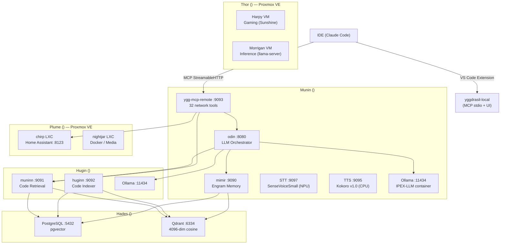

# Yggdrasil Architecture

## Overview

Yggdrasil is a distributed AI infrastructure platform composed of specialized Rust services running on a private LAN. It provides associative memory (engrams), semantic code indexing, LLM orchestration, MCP tool integration for IDE clients, Home Assistant smart-home control, cloud gaming VM management, and inference VM scheduling. Services communicate over HTTP/gRPC; all secrets and IPs are injected via environment variables — never hardcoded.

## Node Topology

| Node | Role | Services |
|------|------|----------|
| **Munin** `<munin-ip>` | Primary compute | Odin :8080, Mimir :9090, Sentinel, MCP Remote :9093, ygg-mcp-server (stdio), ygg-node, Ollama :11434 (IPEX-LLM), STT :9097, TTS :9095 |
| **Hugin** `<hugin-ip>` | Code indexing | Huginn :9092 (health), Muninn :9091, ygg-node, Ollama :11434 |
| **Hades** `<hades-ip>` | Storage only | PostgreSQL :5432 (pgvector), Qdrant :6334 |
| **Thor** `<thor-ip>` | Proxmox VE — compute | Gaming VMs (Harpy), Inference VMs (Morrigan), managed by ygg-gaming |
| **Plume** `<plume-ip>` | Proxmox VE — services | Nightjar (Docker/media), Chirp (Home Assistant :8123), Gitea (LXC), Peckhole (LXC) |

## System Topology



## Service Registry

| Service | Crate | Port | Responsibility |
|---------|-------|------|----------------|
| **Odin** | `crates/odin` | 8080 | OpenAI-compatible API gateway, semantic routing, RAG pipeline, SSE streaming, Mimir proxy, HA context injection, voice WebSocket pipeline (VAD → SDR skill cache → omni chat → legacy STT fallback), SDR skill cache (512 skills, LRU) |
| **Mimir** | `crates/mimir` | 9090 | Engram CRUD, embedding, SHA-256 dedup, LSH indexing, autonomous auto-ingest with SDR template matching |
| **Huginn** | `crates/huginn` | 9092 (health) | File watcher, tree-sitter AST chunking, code indexing daemon |
| **Muninn** | `crates/muninn` | 9091 | Semantic code retrieval (vector + BM25 fusion), read-only |
| **yggdrasil-local** | `extensions/yggdrasil-local` | stdio | VS Code extension + MCP server: 2 tools (`sync_docs`, `screenshot`), status bar, memory dashboard, JSONL event watcher |
| **ygg-mcp-remote** | `crates/ygg-mcp-remote` | 9093 | Remote MCP server: 32 tools + 3 resources over StreamableHTTP (code search, memory, LLM, HA, gaming, vault, deploy, config sync, web search) |

## Crate Architecture

### Service Crates

| Crate | Binary | Purpose |
|-------|--------|---------|
| `odin` | `odin` | LLM orchestrator (see Service Registry) |
| `mimir` | `mimir` | Engram memory service |
| `huginn` | `huginn` | Code indexer daemon |
| `muninn` | `muninn` | Code retrieval service |
| `ygg-gaming` | `ygg-gaming` | Multi-host Proxmox orchestrator — GPU pool, WoL, VM lifecycle per `VmRole` |
| `ygg-mcp-server` | `ygg-mcp-server` | Local MCP stdio server |
| `ygg-mcp-remote` | `ygg-mcp-remote` | Remote MCP HTTP server |
| `ygg-node` | `ygg-node` | Mesh node daemon (mDNS, heartbeats, gate policy, energy) |
| `ygg-sentinel` | `ygg-sentinel` | Log monitoring with SDR anomaly detection and voice alerts |
| `ygg-voice` | `ygg-voice` | Local audio bridge — mic capture → Odin WebSocket → TTS playback |
| `ygg-installer` | `ygg-installer` | Cross-platform install tool (systemd/launchd/Windows Service) |

### Library Crates

| Crate | Responsibility | Consumers |
|-------|---------------|-----------|
| `ygg-domain` | All type definitions: `Engram`, `CodeChunk`, `MemoryTier`, tool catalog (`tools::ALL_TOOLS`), domain errors. Zero I/O. | All crates |
| `ygg-store` | PostgreSQL connection pool, engram/chunk CRUD, Qdrant client | mimir, huginn, muninn |
| `ygg-embed` | Ollama embedding HTTP client — single and batch | mimir, huginn, muninn |
| `ygg-mcp` | MCP tool definitions, server handler, `memory_merge` module | ygg-mcp-server, ygg-mcp-remote |
| `ygg-ha` | Home Assistant REST client, automation YAML generation | ygg-mcp, odin |
| `ygg-config` | JSON/YAML config loader with `${ENV_VAR}` expansion, hot-reload | All services |
| `ygg-server` | Shared HTTP boilerplate: metrics middleware, graceful shutdown, sd_notify | odin, mimir, muninn, huginn, ygg-node |
| `ygg-mesh` | Mesh networking: mDNS discovery, gate policy, node registry, HTTP proxy | ygg-node |
| `ygg-energy` | Wake-on-LAN, power status, `ProxmoxClient` REST wrapper | ygg-gaming, ygg-node |
| `ygg-cloud` | Cloud LLM fallback adapters (OpenAI, Claude, Gemini) with rate limiting | odin |

## Data Flow: Standard Chat Completion

```
Claude Code → ygg-mcp-remote → Odin :8080
                                    │
                          ┌─────────┴─────────┐
                          │ SemanticRouter     │
                          └─────────┬─────────┘
                    ┌───────────────┼───────────────┐
                    ▼               ▼               ▼
               Muninn :9091    Mimir :9090    Ollama (local)
               (code RAG)    (engram RAG)   (generation)
                    └───────────────┴───────────────┘
                                    │
                              SSE stream → client
                                    │
                            Mimir (fire-and-forget store)
```

## Data Flow: Gaming VM Launch

```
MCP client → gaming_tool (ygg-mcp-remote)
                  │
            ygg-gaming launch <vm>
                  │
         1. wake_host() — WoL magic packet if offline
         2. poll Proxmox API until node_online()
         3. find_available_gpu() — query running VM hostpci* configs
         4. set_vm_config() — assign GPU mapping to hostpciN slot
         5. start_vm() — Proxmox API POST
         6. wait_for_vm_status("running")
         7. Role-specific post-boot:
            Gaming   → wait SSH → deploy_pairing() (Sunshine creds)
            Inference → poll GET /health until 200
            Service  → no-op
```

## Gaming Architecture (Sprint 044b)

### Multi-Host Configuration

`GamingConfig` holds a `Vec<HostConfig>`, each with its own Proxmox endpoint, WoL settings, GPU inventory, VM list, and container list. `find_vm()` and `find_container()` search across all hosts by name.

### VmRole Enum

Controls GPU assignment strategy and post-boot actions:

| Variant | GPU Assignment | Post-Boot Action |
|---------|---------------|------------------|
| `Gaming { sunshine_port, sunshine_creds }` | Single GPU via `find_available_gpu()`, `hostpci0` slot, `x-vga=1` flag | SSH readiness poll → deploy Sunshine pairing data |
| `Inference { model, api_port, gpu_count, health_endpoint }` | Multi-GPU loop: assigns `hostpci0`…`hostpciN` | HTTP health probe loop until `GET /health` → 200 |
| `Service` | None | None |

Default variant is `Gaming` with `sunshine_port: 47990`.

### GPU Pool Algorithm

`find_available_gpu()` in `gpu_pool.rs`:
1. Lists all running VMs on the Proxmox node.
2. Fetches `hostpci*` config entries for each running VM.
3. Matches against the `GpuEntry` list by `mapping_id` (preferred) or raw PCI address.
4. Returns the first free GPU sorted by: preferred vendor first, then `priority` ascending.

`gpu_matches()` handles both `mapping=<id>,pcie=1` and raw `0000:43:00.0,pcie=1` hostpci formats, normalizing to base address (strips function number).

### WoL Lifecycle

`wake_host()` sends a UDP magic packet via `ygg_energy::wol::send_wol()`, then polls `ProxmoxClient::node_online()` at configurable intervals until the deadline. Returns `Ok(false)` (not an error) if the host does not respond — callers map this to `LaunchResult::ServerOffline`.

### Timeout Defaults

| Parameter | Default |
|-----------|---------|
| WoL poll window | 30 s |
| WoL poll interval | 5 s |
| VM start timeout | 300 s |
| VM start poll interval | 10 s |
| VM stop timeout | 120 s |
| SSH/health ready timeout | 60 s |

### GPU Release on Stop

`stop()` calls `ProxmoxClient::delete_vm_config_keys()` to remove `hostpci*` entries after the VM halts:
- `Gaming`: removes the single `hostpci_slot` key.
- `Inference`: removes `hostpci0`…`hostpciN-1` keys derived from `gpu_count`.

## Autonomous Memory Pipeline

Claude Code hook scripts intercept Edit/Write/Bash events and call Mimir for ambient memory recall (PreToolUse) and auto-ingest (PostToolUse). Hard timeout: 500 ms. All hooks exit 0 regardless of Mimir availability.

Six insight templates drive auto-ingest selectivity: `bug_fix`, `architecture_decision`, `sprint_lifecycle`, `user_feedback`, `deployment_change`, `gotcha`.

## Odin Agent Loop (Sprint 049)

When a `/v1/chat/completions` request includes a `tools` array and the backend is Ollama, Odin runs an autonomous ReAct loop:

```
LLM request (with 30 tool definitions, filtered by tier)
  │
  ├─ LLM returns tool_calls? → Execute ALL in parallel (futures::join_all)
  │   ├─ Circuit breaker check (Mimir/Muninn: 3 failures → 30s open)
  │   ├─ HTTP dispatch with retry (200ms/800ms backoff for 503/429)
  │   ├─ Per-tool timeout (global default or per-tool override)
  │   ├─ Truncate output to configurable max chars (default 8000)
  │   └─ Feed results back as "tool" role messages
  │
  ├─ LLM returns text? → Return final response
  └─ Max iterations hit? → Force text response (no tools)
```

### Tool Catalog (`ygg-domain::tools`)

The canonical tool catalog lives in `ygg-domain::tools::ALL_TOOLS` — 31 entries with name, description, tier, keywords, timeout override, and voice-always flag. Both Odin's `tool_registry` and MCP's `server.rs` consume this catalog. Odin adds endpoint routing (Mimir/Muninn/OdinSelf/Ha) and JSON parameter schemas; MCP adds the `#[tool_router]` registration.

### Tool Tiers

| Tier | Count | Description |
|------|-------|-------------|
| **Safe** | 14 | Read-only: search_code, query_memory, ha_get_states, web_search, etc. |
| **Restricted** | 16 | Write ops: store_memory, ha_call_service, gaming, deploy, generate, etc. |
| **Blocked** | 0 | Reserved for future use |

Tier filtering is configurable per deployment via `agent.default_tiers` in the Odin config. Default: `["safe"]`.

### Agent Configuration (`AgentLoopConfig`)

| Parameter | Default | Description |
|-----------|---------|-------------|
| `max_iterations` | 10 | Loop cycles before forcing text |
| `max_tool_calls_total` | 30 | Hard cap on total tool executions |
| `tool_timeout_secs` | 30 | Per-tool HTTP timeout |
| `total_timeout_secs` | 300 | Absolute deadline for entire loop |
| `temperature` | 0.3 | LLM temperature for tool-use precision |
| `tool_output_max_chars` | 8000 | Truncation limit per tool output |
| `enable_thinking` | false | LLM reasoning/thinking mode |

### Circuit Breaker

Per-endpoint circuit breakers protect Mimir and Muninn. After 3 consecutive failures, the endpoint is short-circuited for 30 seconds (returns instant error). After cooldown, one probe request is allowed (half-open). On success, the breaker closes.

## Yggdrasil Local — VS Code Extension (Sprint 050)

Replaces the Rust `ygg-mcp-server` binary with a TypeScript VS Code extension that serves as both the **local MCP server** and the **visual interface** for memory operations.

### Components

| Component | File | Purpose |
|-----------|------|---------|
| MCP Server | `src/mcp/server.ts` | stdio transport, serves sync_docs + screenshot tools |
| Status Bar | `src/statusBar.ts` | `$(database) Ygg: N recalled · N stored` |
| Event Watcher | `src/eventWatcher.ts` | Tails `/tmp/ygg-hooks/memory-events.jsonl` |
| Output Channel | `src/outputChannel.ts` | "Yggdrasil Memory" with formatted events |
| Dashboard | `src/dashboard.ts` | Webview panel (Ctrl+Shift+M) with session stats |
| Notifications | `src/notifications.ts` | Configurable toast notifications |

### Auto-Update

`ygg-memory.sh` runs `check_and_update()` on every SessionStart. It compares `package.json` version against the installed extension version. On mismatch: background `npm install` + `npm run compile` + `vsce package` + `code --install-extension`. Same mechanism handles fresh installs, Rust binary migration, and version bumps. Single source of truth: `package.json` version field.

### JSONL Event Protocol

Hooks and MCP tools write events to `/tmp/ygg-hooks/memory-events.jsonl`:

```jsonl
{"ts":"...","event":"init","data":{"count":5}}
{"ts":"...","event":"recall","data":{"count":3,"file":"agent.rs"}}
{"ts":"...","event":"ingest","data":{"stored":true,"file":"agent.rs","cause":"..."}}
{"ts":"...","event":"tool","data":{"name":"sync_docs","status":"ok","duration_ms":3200}}
```

## Memory Merge (ygg-mcp `memory_merge` module)

Detects diverged Claude Code auto-memory files between workstations (local vs remote) by SHA-256 comparison, then calls Odin's LLM endpoint to intelligently merge both versions. Runs automatically at `config_sync` startup and is exposed as `memory_merge_tool` on the local MCP server.

## Encrypted Vault

Mimir hosts an AES-256-GCM encrypted secret vault (`yggdrasil.vault` table). Master key loaded from `MIMIR_VAULT_KEY` env var (base64, 32 bytes). Each secret stored as `nonce (12 bytes) || ciphertext`. Scoped by `(key_name, scope)` with upsert semantics. Exposed via `vault_tool` on ygg-mcp-remote.

## Database Schema

All tables in the `yggdrasil` schema on PostgreSQL at Hades `<hades-ip>:5432`.

| Table | Purpose |
|-------|---------|
| `yggdrasil.engrams` | Cause-effect memory pairs with pgvector embeddings |
| `yggdrasil.lsh_buckets` | LSH index persistence |
| `yggdrasil.indexed_files` | Source files tracked by Huginn |
| `yggdrasil.code_chunks` | AST-extracted semantic units with tsvector (BM25) |
| `yggdrasil.vault` | AES-256-GCM encrypted secrets |

**Qdrant collections** on Hades `<hades-ip>:6334`:
- `engrams` — 4096-dim cosine, point IDs match `engrams.id`
- `code_chunks` — 4096-dim cosine, point IDs match `code_chunks.id`

## Configuration

Each service loads from `configs/<service>/config.json` (or `.yaml`). The `ygg-config` crate handles format auto-detection, `${ENV_VAR}` expansion, and hot-reload via filesystem notifications. Example configs at `configs/<service>/config.example.json`. The `ygg-gaming` crate has its own inline config loader (`config::load_config()`) with the same `${VAR}` expansion semantics.

## External Services

| Service | Host | Port | Used By |
|---------|------|------|---------|
| Home Assistant | Chirp `<ha-ip>` | 8123 | ygg-ha (via ygg-mcp and odin) |
| Ollama (Munin) | Munin (IPEX-LLM container) | 11434 | odin, mimir |
| Ollama (Hugin) | `<hugin-ip>` | 11434 | odin, huginn, muninn |
| PostgreSQL | Hades `<hades-ip>` | 5432 | mimir, huginn, muninn (via ygg-store) |
| Qdrant | Hades `<hades-ip>` | 6334 | mimir, huginn, muninn (via ygg-store) |
| STT (SenseVoiceSmall) | Munin | 9097 | odin voice pipeline — ONNX + OpenVINO EP (Intel NPU) |
| TTS (Kokoro v1.0) | Munin | 9095 | odin voice pipeline — ONNX Runtime CPU |
| Proxmox VE (Thor) | `<thor-ip>` | 8006 | ygg-gaming, ygg-energy |
| Proxmox VE (Plume) | `<plume-ip>` | 8006 | ygg-gaming, ygg-energy |

---

## Changelog

| Date | Change |
|------|--------|
| 2026-03-09 | Initial architecture document. Service registry, data flows, schema overview. |
| 2026-03-09 | Updated topology: Huginn/Muninn on Hugin, Odin/Mimir on Munin. Chat completion and Mimir proxy flows added. |
| 2026-03-09 | Added ygg-mcp-server, chirp/HA to topology. MCP tool call and HA automation flows added. |
| 2026-03-09 | Production hardening (Sprint 010): systemd watchdog, Prometheus metrics, backup, graceful degradation. |
| 2026-03-22 | Sprint 044: Autonomous Memory Pipeline — PreToolUse recall hook, PostToolUse ingest hook, 6 insight templates. |
| 2026-03-23 | Sprint 045: STT moved to Intel AI Boost NPU (OpenVINO EP), 2.5x latency reduction. TTS remains CPU. |
| 2026-03-18 | Odin SDR Skill Cache: pre-computed FFT plan, two-phase RwLock, 512-skill LRU, deferred PCM allocation. |
| 2026-03-26 | Added ygg-mcp-remote (29 tools), encrypted vault, 10 shared library crates, ygg-config YAML support. |
| 2026-03-27 | Sprint 044b: Full rewrite. Gaming architecture section added — multi-host GamingConfig, VmRole enum (Gaming/Inference/Service), GPU pool algorithm, WoL lifecycle, inference health probes. Thor/Plume nodes added to topology. Memory merge module documented. PostgreSQL relocated to Hades. |
| 2026-03-28 | Sprint 049: Agent loop hardening — parallel tool execution, canonical tool catalog in ygg-domain::tools, circuit breaker for Mimir/Muninn, retry with backoff, 30 tools in Odin registry (was 20), configurable agent params. Security sanitization. |
| 2026-03-28 | Sprint 050: Yggdrasil Local VS Code extension — replaces ygg-mcp-server Rust binary. Node.js MCP server (sync_docs + screenshot), status bar, memory dashboard, JSONL event watcher, configurable notifications. Versioned auto-update via check_and_update(). |
