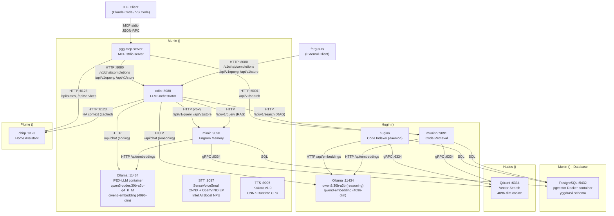
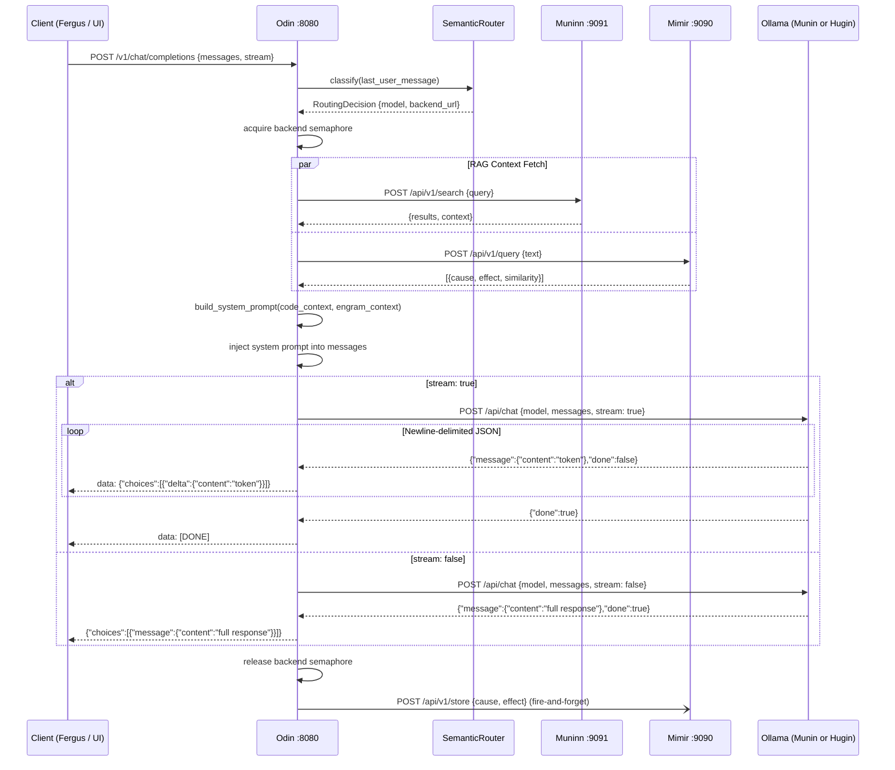
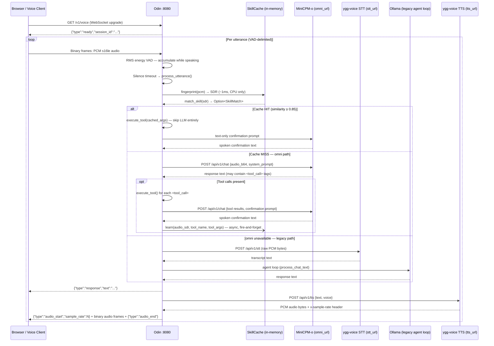
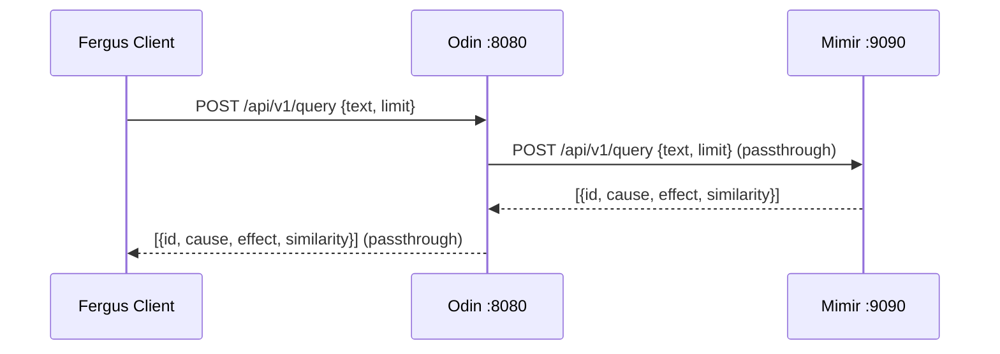
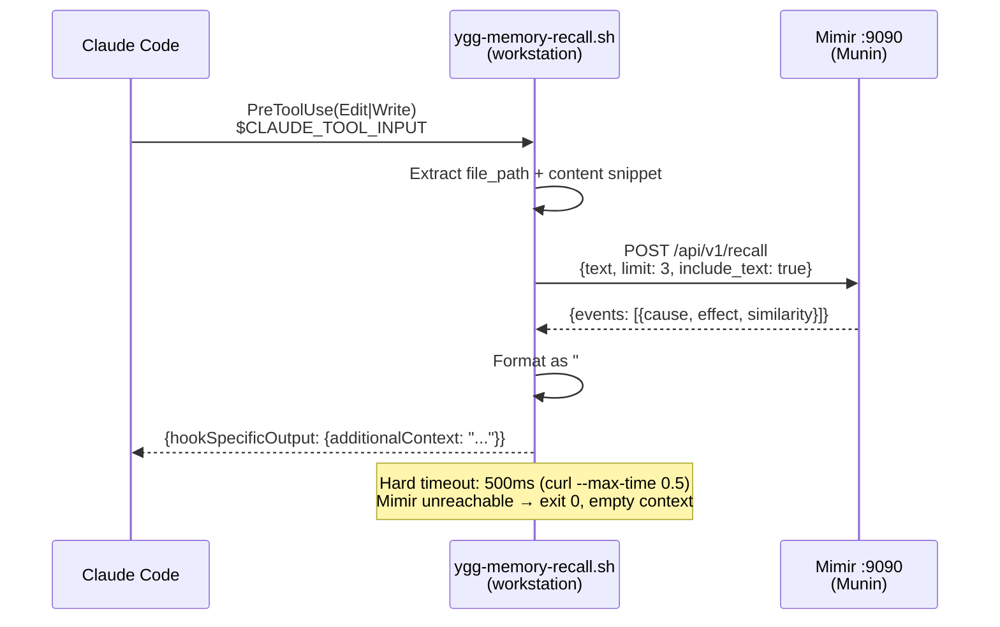
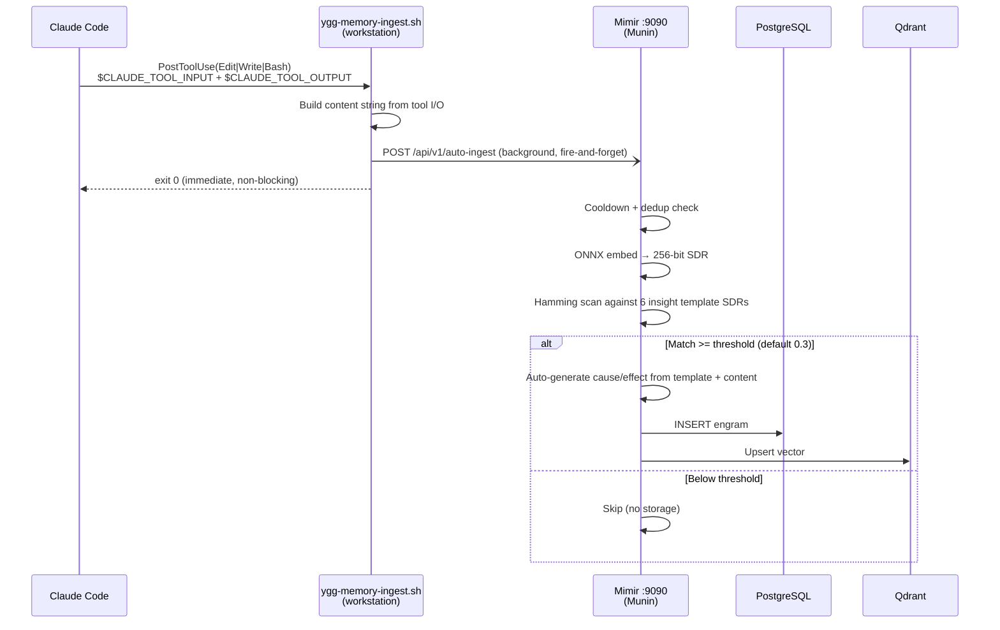
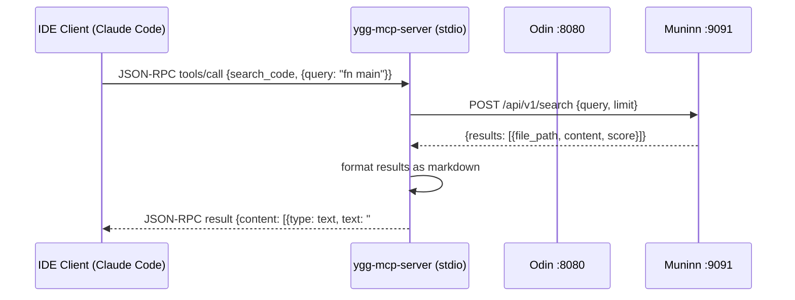
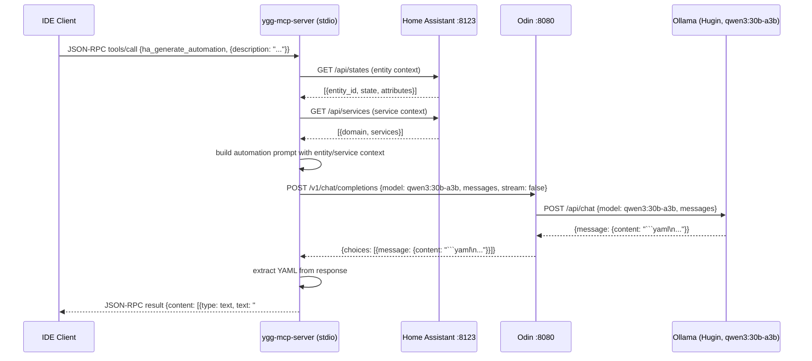

# Yggdrasil Architecture

## Overview

Yggdrasil is a distributed AI memory and retrieval system composed of specialized Rust services that communicate over HTTP/gRPC on a private LAN. It provides associative memory (engrams), code indexing, semantic retrieval, MCP tool integration for IDEs, and Home Assistant smart-home control for the Fergus AI assistant.

## System Topology



## Service Registry

| Service | Crate | Binary | Port | Responsibility | Owned Data | Status |
|---------|-------|--------|------|----------------|------------|--------|
| **Odin** | `crates/odin` | `odin` | 8080 | OpenAI-compatible API gateway, semantic routing, RAG pipeline, SSE streaming, Mimir proxy, HA context injection, Prometheus metrics, voice WebSocket pipeline (VAD → SDR skill cache → omni chat → legacy STT fallback), SDR skill cache (`MAX_SKILLS=512`, LRU eviction) | Routing rules (in-memory from config), HA context cache (60s TTL), SDR skill cache (in-memory, `Arc<RwLock<Vec<CachedSkill>>>`) | DONE (Sprint 005) |
| **Mimir** | `crates/mimir` | `mimir` | 9090 | Engram memory CRUD, embedding, dedup, LSH indexing, autonomous auto-ingest with SDR template matching | `yggdrasil.engrams`, `yggdrasil.lsh_buckets`, Qdrant `engrams` collection, in-memory insight template SDRs, per-workstation cooldown map | DONE (Sprint 002, auto-ingest Sprint 044) |
| **Huginn** | `crates/huginn` | `huginn` | 9092 (health) | File watcher, tree-sitter AST chunking, code indexing | `yggdrasil.indexed_files`, `yggdrasil.code_chunks`, Qdrant `code_chunks` collection | DONE (Sprint 003) |
| **Muninn** | `crates/muninn` | `muninn` | 9091 | Semantic code retrieval (vector + BM25 fusion) | Read-only from Huginn's tables | DONE (Sprint 004) |
| **ygg-mcp-server** | `crates/ygg-mcp-server` | `ygg-mcp-server` | N/A (stdio) | MCP local server exposing 2 tools (sync_docs, screenshot) to IDE clients via JSON-RPC over stdin/stdout | None (stateless bridge) | DONE (Sprint 006) |
| **ygg-mcp-remote** | `crates/ygg-mcp-remote` | `ygg-mcp-remote` | 9093 | MCP remote server exposing 29 tools and 3 resources to IDE clients via StreamableHTTP. Network tools only (code search, memory, LLM, HA, gaming, vault, deploy, config sync). | None (stateless bridge to backend services) | DONE (Sprint 027) |

## Shared Libraries

| Crate | Responsibility | Dependents |
|-------|---------------|------------|
| `ygg-domain` | All type definitions: `Engram`, `CodeChunk`, `MemoryTier`, config structs, domain errors. Leaf crate with zero I/O. | All services |
| `ygg-store` | PostgreSQL connection pool (`Store`), engram CRUD, chunk CRUD, Qdrant client (`VectorStore`). All database I/O. | mimir, huginn, muninn |
| `ygg-embed` | Ollama embedding HTTP client (`EmbedClient`). Single and batch embedding. | mimir, huginn, muninn |
| `ygg-mcp` | MCP tool/resource definitions, server handler, tool implementations (code search, memory, generation, HA). Library crate. | ygg-mcp-server |
| `ygg-ha` | Home Assistant REST API client (`HaClient`), automation YAML generation (`AutomationGenerator`). | ygg-mcp, odin |
| `ygg-config` | Unified configuration loader: JSON/YAML auto-detect, `${ENV_VAR}` expansion, validation, hot-reload via filesystem notifications. | All services |
| `ygg-voice` | Local audio bridge for voice assistant. Captures microphone, streams to Odin WebSocket, plays TTS. | Standalone client binary |
| `ygg-server` | Shared HTTP service boilerplate: metrics middleware, graceful shutdown, error types, health checks, telemetry init, systemd sd_notify. | odin, mimir, muninn, huginn, ygg-node |
| `ygg-gaming` | GPU-pooled cloud gaming orchestrator. Proxmox VM management, GPU assignment, Wake-on-LAN for Thor. | ygg-mcp (gaming_tool) |
| `ygg-sentinel` | Distributed log monitoring with SDR anomaly detection. Collects logs from mesh nodes, triggers voice alerts. | Standalone daemon |
| `ygg-node` | Mesh node daemon. mDNS discovery, heartbeats, gate policy, energy management, inter-node HTTP proxy. | Standalone daemon, one per node |
| `ygg-mesh` | Mesh networking library. Discovery, gate policy, node registry, HTTP proxy. | ygg-node |
| `ygg-cloud` | Cloud LLM fallback provider abstraction. OpenAI, Claude, Gemini adapters with rate limiting. | odin (fallback routing) |
| `ygg-energy` | Energy management policy. Wake-on-LAN, power status monitoring, Proxmox integration. | ygg-node |
| `ygg-installer` | Cross-platform installation tool. Detects OS, builds binaries, configures systemd/launchd/Windows Service. | Standalone CLI |

## Data Flow: Engram Store

```mermaid
sequenceDiagram
    participant C as Fergus Client
    participant M as Mimir
    participant O as Ollama
    participant PG as PostgreSQL
    participant QD as Qdrant

    C->>M: POST /api/v1/store {cause, effect}
    M->>M: SHA-256(cause + effect) for dedup
    M->>O: POST /api/embeddings {model, prompt: cause}
    O-->>M: {embedding: [f32; 4096]}
    M->>PG: INSERT INTO engrams (embedding, hash, ...)
    PG-->>M: OK / 23505 (duplicate)
    M->>QD: Upsert point (id, embedding)
    QD-->>M: OK
    M->>M: LSH index insert
    M-->>C: 201 {id: "uuid"}
```

## Data Flow: Engram Query

```mermaid
sequenceDiagram
    participant C as Fergus Client
    participant M as Mimir
    participant O as Ollama
    participant QD as Qdrant
    participant PG as PostgreSQL

    C->>M: POST /api/v1/query {text, limit}
    M->>O: POST /api/embeddings {model, prompt: text}
    O-->>M: {embedding: [f32; 4096]}
    M->>QD: Search(embedding, limit)
    QD-->>M: [(uuid, score), ...]
    M->>PG: SELECT * FROM engrams WHERE id = ANY($1)
    PG-->>M: [Engram, ...]
    M->>PG: UPDATE access_count, last_accessed
    M-->>C: 200 [{id, cause, effect, similarity}, ...]
```

## Data Flow: Chat Completion (Odin Orchestrator)



## Odin: SDR Skill Cache

`SkillCache` (in `crates/odin/src/skill_cache.rs`) provides sub-millisecond dispatch for repeat voice commands by fingerprinting raw PCM audio into a 256-bit SDR (Mel spectrogram → SHA-256) and matching against cached tool calls via Hamming similarity.

### Construction

`SkillCache::new()` pre-computes and stores an `Arc<dyn Fft<f32>>` FFT plan, a Mel filterbank, and a Hann window once at startup. No `FftPlanner` is created per call.

### Concurrency: Two-Phase RwLock

Both `match_skill` and `learn` use a two-phase lock pattern to maximise read concurrency:

- **Phase 1 (read lock):** O(N) Hamming scan to find a candidate. The read lock is dropped before any write.
- **Phase 2 (write lock):** Re-verify the candidate by SDR equality (not Hamming re-scoring) to guard against TOCTOU races from concurrent `learn()` calls. Write lock is acquired only on a hit (for `match_skill`) or to insert (for `learn`).
- `learn()` also performs a final dedup check under the write lock before inserting, protecting against two concurrent `learn()` calls inserting the same skill between the two lock acquisitions.

### Capacity

| Constant | Value | Description |
|----------|-------|-------------|
| `MAX_SKILLS` | 512 | Hard cap on cached skills |
| `DEFAULT_THRESHOLD` | 0.85 | Minimum Hamming similarity for a cache hit |

When `MAX_SKILLS` is reached, the least-recently-used skill is evicted via `swap_remove` (O(1)).

## Data Flow: Voice WebSocket Pipeline (Odin)

The voice pipeline is served at `GET /v1/voice` (WebSocket upgrade). Audio arrives as raw PCM s16le at 16 kHz mono.



**Key behaviours:**
- `pcm_bytes` allocation (~64 KB per utterance) is deferred until after the skill cache check. Cache hits pay no allocation cost.
- `seen_resume` is set only after session validation succeeds, preventing stale session IDs from being accepted.
- `send_tts()` is a shared helper used by both the cache-hit path and the normal response path.
- The `pcm_to_bytes()` helper centralises i16→u8 conversion and is called at exactly two sites in `voice_ws.rs`.

## Data Flow: Mimir Proxy (Fergus Compatibility)



## Autonomous Memory Pipeline (Sprint 044)

Claude Code hook scripts (`settings.json`) intercept Edit/Write/Bash tool invocations to provide ambient memory without explicit MCP tool calls. Memory recall and ingestion happen automatically, costing zero context tokens.

### Recall Flow (PreToolUse)



### Ingest Flow (PostToolUse)



### Insight Templates

Six pre-seeded engrams (tagged `insight_template`) define what content is worth auto-storing. Mimir loads their SDR fingerprints at startup and scans incoming content against them.

| Template | Matches On |
|----------|-----------|
| `bug_fix` | Error resolution, debugging sessions, root cause identification |
| `architecture_decision` | System design, module boundaries, API contract changes |
| `sprint_lifecycle` | Sprint start/end, scope modifications, planning |
| `user_feedback` | Corrections, preferences, workflow guidance |
| `deployment_change` | SSH/Docker/systemctl commands, config deployments |
| `gotcha` | Workarounds, caveats, non-obvious constraints |

### Graceful Degradation

All hook scripts exit 0 regardless of Mimir availability. If Mimir is unreachable, the recall hook returns empty `additionalContext` (no block, no error) and the ingest hook silently drops the request. Explicit `query_memory_tool` / `store_memory_tool` remain available as manual fallback.

### Visual Indicators

Hook scripts emit colored status lines to stderr (visible in the terminal, zero context cost for Claude):
- Recall: `[mem] <- recalled N engrams` (or silent on miss/failure)
- Ingest: `[mem] -> stored: {template}` or `[mem] -> skipped`

## Data Flow: MCP Tool Call (Sprint 006)



## Encrypted Vault (Sprint 048)

Mimir provides an AES-256-GCM encrypted secret vault for storing API keys, passwords, SSH keys, and credentials. Secrets are encrypted client-side before storage in PostgreSQL.

### Vault Architecture

- **Master Key:** Loaded from `MIMIR_VAULT_KEY` environment variable (base64-encoded 32-byte AES-256 key)
- **Encryption:** AES-256-GCM with unique random 96-bit nonce per secret
- **Storage:** `nonce (12 bytes) || ciphertext` as BYTEA in `yggdrasil.vault` table
- **Operations:** `set_secret`, `get_secret`, `list_secrets` (metadata only), `delete_secret`
- **MCP Tool:** `vault_tool` on the remote server exposes get/set/list/delete

Secrets are scoped by namespace (`scope` field) and identified by `key_name`. Upsert semantics on `(key_name, scope)`.

## Data Flow: HA Automation Generation (Sprint 006)



## External Services

| Service | Host | Port | Protocol | Used By |
|---------|------|------|----------|---------|
| Home Assistant | chirp (`<ha-ip>`) | 8123 | HTTP REST + Bearer token | ygg-ha (via ygg-mcp-server and odin) |
| Ollama (Munin) | localhost (IPEX-LLM container) | 11434 | HTTP | odin, mimir |
| Ollama (Hugin) | `<hugin-ip>` | 11434 | HTTP | odin, huginn, muninn |
| PostgreSQL | Munin (localhost, pgvector Docker) | 5432 | SQL | mimir, huginn, muninn (via ygg-store) |
| Qdrant | hades (`<hades-ip>`) | 6334 | gRPC | mimir, huginn, muninn (via ygg-store) |
| STT (SenseVoiceSmall) | Munin (localhost) | 9097 | HTTP | odin (voice pipeline) — ONNX + OpenVINO EP on Intel NPU |
| TTS (Kokoro v1.0) | Munin (localhost) | 9095 | HTTP | odin (voice pipeline) — ONNX Runtime CPU |

## Database Schema

All tables live in the `yggdrasil` schema on PostgreSQL (pgvector Docker container on Munin, localhost:5432).

### Engram Tables (Migration 001)
- `yggdrasil.engrams` -- cause-effect memory pairs with pgvector embeddings
- `yggdrasil.lsh_buckets` -- LSH index persistence (table_idx, bucket_hash, engram_id)

### Code Index Tables (Migration 002)
- `yggdrasil.indexed_files` -- tracked source files with content hashes
- `yggdrasil.code_chunks` -- AST-extracted semantic units with tsvector for BM25

### Qdrant Collections (on Hades `<hades-ip>`:6334)
- `engrams` -- 4096-dim cosine, point IDs match `engrams.id`
- `code_chunks` -- 4096-dim cosine, point IDs match `code_chunks.id`

## Configuration

Each service loads its config from `configs/<service>/config.json` (or `.yaml` — format is auto-detected by extension). Config loading uses `ygg-config` which supports `${ENV_VAR}` expansion for secrets. CLI flags can override specific values (e.g., `--database-url`). Example configs are at `configs/<service>/config.example.json`.

---

## Changelog

| Date | Change | Author |
|------|--------|--------|
| 2026-03-09 | Initial architecture document. Service registry, data flows, schema overview. | system-architect |
| 2026-03-09 | Updated topology: Huginn and Muninn on Hugin (<hugin-ip>), Odin and Mimir on Munin (<munin-ip>). Added Odin chat completion and Mimir proxy data flows. Updated service registry with Sprint 005 Odin details. | system-architect |
| 2026-03-09 | Added ygg-mcp-server to topology and service registry (Sprint 006). Added MCP tool call data flow. Added chirp (Home Assistant) to topology. Added HA automation generation data flow (Sprint 007). Added External Services table. Updated ygg-mcp and ygg-ha library descriptions. | system-architect |
| 2026-03-09 | Sprint 008 planned: Mimir Advanced Memory Management -- hierarchical summarization, Core tier injection, sliding-window eviction. Sprint 009 planned: Hardware Optimization -- iGPU SYCL, AVX-512, Exo eval, candle embedder. Sprint 010 planned: Production Hardening -- systemd units, Prometheus metrics, backup, deployment scripts, graceful degradation. Huginn gains health listener on port 9092. | system-architect |
| 2026-03-09 | Sprint 005 finalized as DONE. Corrected stale references: Hugin model updated from QwQ-32B to qwen3:30b-a3b (Sprint 013). Embedding dimension corrected from 1024 to 4096 (qwen3-embedding actual output). PostgreSQL location corrected from Hades to Munin pgvector Docker container. Munin Ollama annotated as IPEX-LLM container (Sprint 014). Huginn port 9092 added to service registry. All service statuses updated to DONE. | system-architect |
| 2026-03-09 | Sprint 006 finalized as DONE. ygg-mcp-server status updated to DONE in service registry. HA tools merged into Sprint 006 (originally planned for Sprint 007). HA automation data flow re-attributed from Sprint 007 to Sprint 006. 9 tools + 2 resources fully implemented. Known discrepancy: AutomationGenerator requests model qwq-32b but actual Hugin model is qwen3:30b-a3b. | system-architect |
| 2026-03-09 | Sprint 010 (Production Hardening) finalized as DONE. Bug fixes applied: (1) all qwq-32b/QwQ-32B model references in ygg-ha and ygg-mcp-server replaced with qwen3:30b-a3b -- resolves the discrepancy noted in the Sprint 006 changelog entry; (2) HA_TOKEN env var expansion added to ygg-mcp-server startup; (3) backup-hades.sh PG host corrected from Hades (<hades-ip>/postgres) to Munin (127.0.0.1/yggdrasil); (4) WatchdogSec=30 re-enabled in all 4 daemon systemd units (odin, mimir, huginn, muninn). Two deploy-only items remain for infra-devops: backup cron job installation on Munin, and NetworkHardware.md model reference update. 57 tests pass, zero qwq references remaining. | system-architect |
| 2026-03-22 | Sprint 044: Added Autonomous Memory Pipeline section. Mimir service description updated with auto-ingest responsibility and SDR template matching. Added recall flow (PreToolUse hook -> Mimir /api/v1/recall with include_text), ingest flow (PostToolUse hook -> Mimir /api/v1/auto-ingest -> SDR template scan -> conditional engram storage), insight template table, graceful degradation strategy, and visual indicator documentation. | system-architect |
| 2026-03-23 | Sprint 045: Voice Pipeline NPU Acceleration. STT (SenseVoiceSmall) moved to Intel AI Boost NPU via ONNX Runtime OpenVINO EP — 2.5x latency reduction (e.g. 5s audio: 665ms CPU → 303ms NPU). TTS (Kokoro v1.0) tested on NPU but incompatible (dynamic STFT shapes), remains on CPU. NPU driver v1.30.0 installed. Both servers rewritten with dual-backend (NPU/CPU) and env-var rollback (STT_DEVICE, TTS_DEVICE). FunASR ONNX export fixed (Less node type mismatch). STT/TTS added to topology diagram and External Services table. | system-architect |
| 2026-03-18 | Odin crate improvements (simplify sprint): (1) `SkillCache` pre-computes `Arc<dyn Fft<f32>>` at construction — no per-call `FftPlanner`; (2) `match_skill` and `learn` both use two-phase RwLock (read for O(N) scan, write only on hit/insert) with TOCTOU guard via SDR equality re-verify under write lock; (3) `learn` enforces `MAX_SKILLS=512` cap with O(1) LRU `swap_remove` eviction; (4) `process_utterance` reduced to 4 params (reads `http`, `stt_url`, `tts_url`, `omni_url` from `AppState`); (5) `pcm_bytes` allocation deferred past skill cache check (saves ~64 KB on cache hits); (6) `seen_resume` flag set only inside session validation success block; (7) `send_tts()` helper extracted; (8) `to_cloud_messages()` private helper extracted in `handlers.rs` to deduplicate `try_cloud_fallback`/`try_cloud_or_fail`; (9) `task_worker.rs` calls `backends.first()` once via `let b` binding. Added Voice WebSocket Pipeline data flow and SDR Skill Cache sections. Munin Ollama inference (3B+ models) confirmed fixed as of 2026-03-18. | system-architect |
| 2026-03-26 | Documentation audit and update. Added ygg-mcp-remote to service registry (29 tools, StreamableHTTP). Added 10 shared library crates (ygg-config, ygg-voice, ygg-server, ygg-gaming, ygg-sentinel, ygg-node, ygg-mesh, ygg-cloud, ygg-energy, ygg-installer). Added Encrypted Vault section. Updated config format (JSON default with YAML support via ygg-config). Updated ygg-mcp-server tool count (2 local tools). | system-architect |
